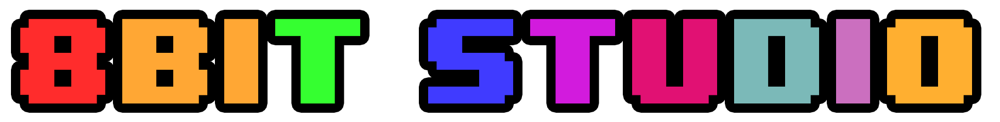
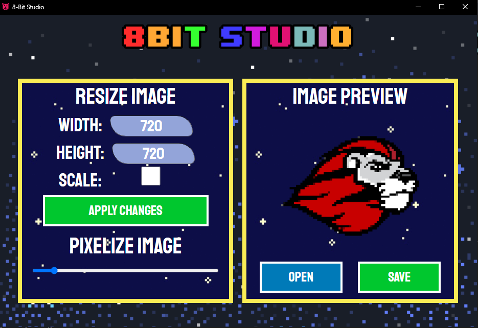
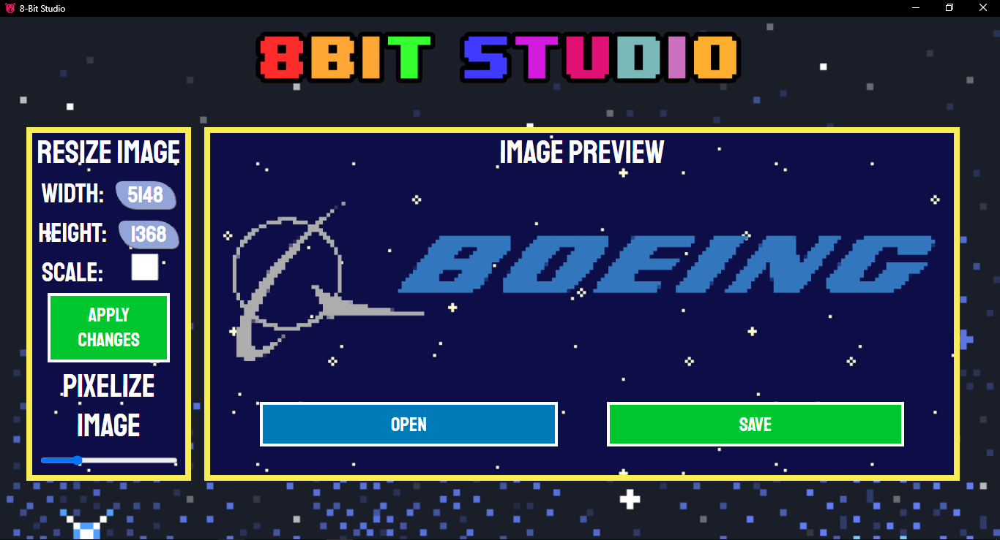

<h1>Easily Make Images 8-Bit Looking!<h1>

**
Easily turn boring, dull images into cool pixelated versions of themselves!
**

 

# How to Use
[Demo Video](https://youtu.be/JpKMD_iQf7A)
### Getting Started
You could just clone the repository and then execute the script.py file in some IDE or using the terminal. 

I also included a stand-alone executable located in the dist folder if you'd prefer to use that. However, it does take a while to load but that could just be because of my toaster laptop. 

### Loading in an Image
Click on the open file button to get started.

### Resize Images
Resize your image by changing the dimensions manually in the input boxes. If you want to make sure your image stays at the same scale, just click on the "SCALE" checkbox. 

### Pixelate Images
Just use the slider located at the side and drag it to pixelate your image! Easy peasy!

### Saving your Image
Save your image by clicking on the green save button!

 

 

 

# The Backstory
A couple of months ago, I was getting into game development and wanted to make a browser based game (at the time I didn't realize you could do that with Unity). I ended up coding it in JavaScript using the p5.js graphical library.

I wanted to make it an 8-bit style game because they look so dope. Just one small problem: I wasn't that good at pixel art. :(( I ended up getting help from some friends so that wasn't really a big issue, but at the time, I wished that there was some easy way to make my images look more pixelated to match the theme of the game. 

AFTER I made the game, I realized how you could just shrink images and resize them to make them look pixelated. Ta-da! And that's the inspiration for this project.

# How It Was Made
8-Bit Studio was made with HTML, CSS, JavaScript as the frontend and Python for the backend. For the image processing, I used Python Imaging Library (PIL). To allow for the backend to communicate with the frontend, I used [eel](https://github.com/samuelhwilliams/Eel), a Python library used to make Electron-like GUI applications. 

Originally, I intended to make my GUI with Electron, but after stumbling across eel, I just knew I had to use it because the name was so funny.

So why'd I create this desktop application for a hackathon centered around the New Year? 

To me, the new year symbolizes an opportunity for growth. Prior to the hackathon, I had an irrational fear of HTML/CSS because it looked so tedious-- and it was LOL. I figured that since it was a new year I might as well force myself to learn how to use HTML/CSS because I was pretty sure I couldn't run away from it forever.

Overall, the experience was meh. I think I lost a couple of brain cells along the way trying to learn how to position HTML elements with CSS and probably spent more time on StackOverflow than on VSCode. In the end, I'm still glad I tried something new for this hackathon. I definitely learned a ton!

